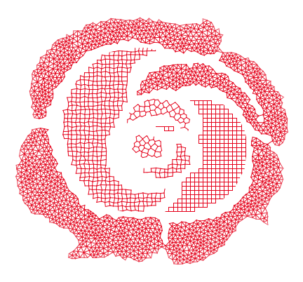

*treillis*: lattices generation and simulation
==============================================

*treillis* (/tʁɛji/, French for truss) is a Python library built to help researchers and whoever is interested in microlattices. It provides tools to modelize 2D and 3D microlattices, to compute their elastic properties as well as calculate stresses, strains and elastic constants.
It was written by experimental physicists with the language that they know, and may need some optimization work, but aims at being as easy to use and iterate on as possible.

*treillis* offers tools to
- generate lattices from different periodic or random base meshes
- modify lattice structures by playing with the connectivity, the element shape, the node position...
- display lattices in paper-quality figures or in interactive 3D figures
- apply solid mechanics models to the lattices by treating them as basic meshes

Install
-------
### Install from the source as editable
Clone the repository.

#### Using Pixi
Install the latest version of [Pixi](https://pixi.prefix.dev/latest/), open a command terminal in the folder root and input `pixi shell`.

#### Using pip or conda
- Open a conda command terminal in the folder root.
- Create the treillis environment from environment.yml with
```conda env create --name treillis --file=environment.yml```
- install treillis in the environment as editable
   - with pip: `pip install -e .`
   - with conda: `conda install conda-build; conda develop .`


### Pypi
In your preferred command invite, in an isolated environment, write `pip install treillis==1.4`


Documentation
-------------

Find the *treillis* documentation [here](https://treillis.readthedocs.io/en/latest/).

License
-------

*treillis* is under a GNU lesser general public license v3.0. See [LICENSE](LICENSE).

Citation
--------

If you use this library, please kindly cite us! See the [CITATION](CITATION.cff) file.
