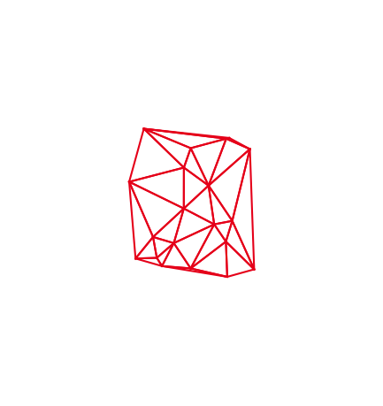
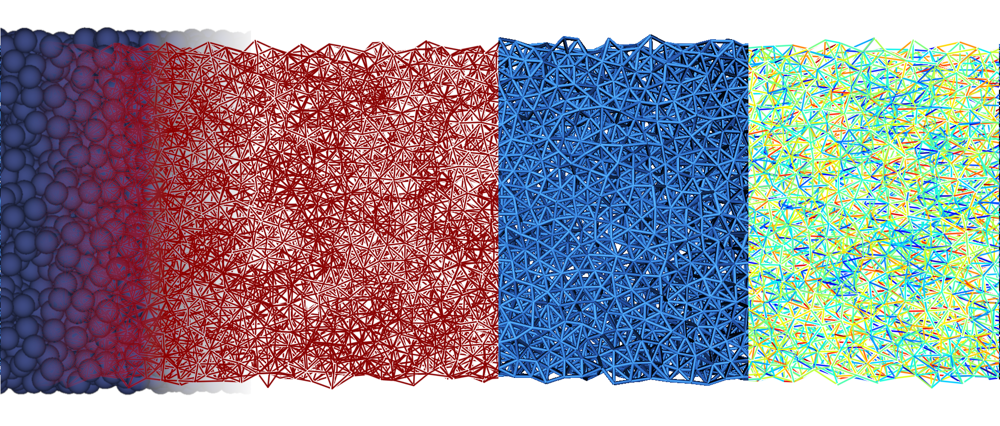
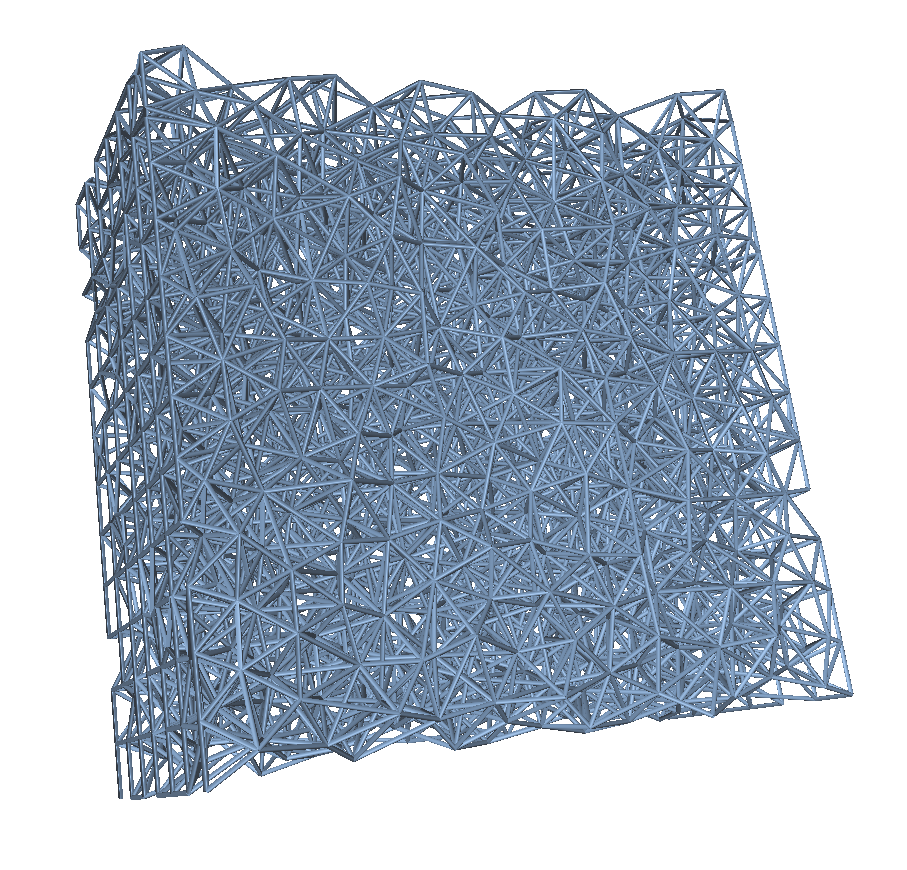

The Lattices
============

The :py:class:`lattice <treillis.Lattice>` is the main object manipulated in **treillis**. Lattices and lattice-like objects like :py:class:`elements <treillis.mechanics.Element>` are networks defined almost entirely by their ``nodes`` i.e. the points in space that are linked together, and their ``elements`` which are the links per say.

Generating lattices
-------------------

There are several ways to generate lattices depending on the wanted result, which are described below.

Starting from scratch: the ``initialize`` class function
^^^^^^^^^^^^^^^^^^^^^^^^^^^^^^^^^^^^^^^^^^^^^^^^^^^^^^^^^

When creating a lattice from scratch, the easiest way is to create them using :any:`Lattice.initialize`. This function takes three positional arguments, including the ``size`` of the resulting lattice, which defines the shape of its :py:class:`domain <treillis.Domain>`. There are four shape sizes possible, leading to three domain shapes:

- size of length 0 (``float``) or 1: spherical domain, the size is the radius
- size of length 2: box domain, ``size[0]`` is the x-length and ``size[1]`` is the y-length
- size of length 3: box domain, ``size[0]`` is the x-length, ``size[1]`` is the y-length, and ``size[2]`` is the z-length
- size of length 5: wedge-splitting geometry. The first three positions in ``size`` are the lengths along x, y, and z (which must be given even if the sample is 2D, it can be equal to 0), then the next two are respectively the width and depth of the cut on the left of the sample:

.. code-block::
   
            e
          <--->
           ________________________
          |@@@@@@@@@@@@@@@@@@@@@@@@|  ^
      ^   |@@@@@@@@@@@@@@@@@@@@@@@@|  |
    d |       |@@@@@@@@@@@@@@@@@@@@|  |
      |       |@@@@@@@@@@@@@@@@@@@@|  | b        and c is the depth in 3D
      v   |@@@@@@@@@@@@@@@@@@@@@@@@|  |
          |@@@@@@@@@@@@@@@@@@@@@@@@|  |
                                      v
          <----------------------->
                      a

The other parameters are the average length of the elements, and the wanted :py:class:`mesh type <treillis.Mesh>`, chosen among twelve possible options:

- ``'Tri'``: Triangular
- ``'Square'``: Square
- ``'Hexa'``: Hexagonal
- ``'TriPrism'``: Quasi-2D Triangular
- ``'HexaPrism'``: Quasi-2D Hexagonal
- ``'Cubic'``: Cubic
- ``'Octa'``: Rhombo-hexagonal dodecahedron
- ``'Dodec'``: Rhombic dodecahedron
- ``'TriDT'``: 2D Delaunay triangulation on random close packing
- ``'TriDT3D'``: 3D Delaunay on RCP
- ``'Vor'``: 2D Voronoi tesselation on RCP
- ``'Vor3D'``: 3D Voronoi on RCP

Find below how to generate spherical lattices in each mesh type:

.. tab-set::
   
   .. tab-item:: Triangular
   
      .. grid::
         :gutter: 0
         :margin: 0
         
         .. grid-item::
            :columns: 8
            :padding: 0
            
            .. code-block:: python
              
               import treillis
               
               lat = treillis.Lattice.initialize(8, 1, 'Tri')
               
               # You can then import a submodule from 
               # display to observe the lattice
           
         .. grid-item::
            :columns: 4
            :padding: 0
            
            .. image:: sph_lattices/tri.png
   
   .. tab-item:: Square
   
      .. grid::
         :gutter: 0
         :margin: 0
         
         .. grid-item::
            :columns: 8
            :padding: 0
            
            .. code-block:: python
              
               import treillis
               
               lat = treillis.Lattice.initialize(8, 1, 'Square')
               
               # You can then import a submodule from 
               # display to observe the lattice
           
         .. grid-item::
            :columns: 4
            :padding: 0
            
            .. image:: sph_lattices/square.png
   
   .. tab-item:: Hexagonal
   
      .. grid::
         :gutter: 0
         :margin: 0
         
         .. grid-item::
            :columns: 8
            :padding: 0
            
            .. code-block:: python
              
               import treillis
               
               lat = treillis.Lattice.initialize(8, 1, 'Hexa')
               
               # You can then import a submodule from 
               # display to observe the lattice
           
         .. grid-item::
            :columns: 4
            :padding: 0
            
            .. image:: sph_lattices/hexa.png
   
   .. tab-item:: Triangular prism
   
      .. grid::
         :gutter: 0
         :margin: 0
         
         .. grid-item::
            :columns: 8
            :padding: 0
            
            .. code-block:: python
              
               import treillis
               
               lat = treillis.Lattice.initialize(8, 1, 'TriPrism')
               
               # You can then import a submodule from 
               # display to observe the lattice
           
         .. grid-item::
            :columns: 4
            :padding: 0
            
            .. image:: sph_lattices/trip.png
   
   .. tab-item:: Hexagonal prism
   
      .. grid::
         :gutter: 0
         :margin: 0
         
         .. grid-item::
            :columns: 8
            :padding: 0
            
            .. code-block:: python
              
               import treillis
               
               lat = treillis.Lattice.initialize(8, 1, 'HexaPrism')
               
               # You can then import a submodule from 
               # display to observe the lattice
           
         .. grid-item::
            :columns: 4
            :padding: 0
            
            .. image:: sph_lattices/hexap.png
   
   .. tab-item:: Cubical
   
      .. grid::
         :gutter: 0
         :margin: 0
         
         .. grid-item::
            :columns: 8
            :padding: 0
            
            .. code-block:: python
              
               import treillis
               
               lat = treillis.Lattice.initialize(8, 1, 'Cubic')
               
               # You can then import a submodule from 
               # display to observe the lattice
           
         .. grid-item::
            :columns: 4
            :padding: 0
            
            .. image:: sph_lattices/cubic.png
   
   .. tab-item:: Rhomboid
   
      .. grid::
         :gutter: 0
         :margin: 0
         
         .. grid-item::
            :columns: 8
            :padding: 0
            
            .. code-block:: python
              
               import treillis
               
               lat = treillis.Lattice.initialize(8, 1, 'Octa')
               
               # You can then import a submodule from 
               # display to observe the lattice
           
         .. grid-item::
            :columns: 4
            :padding: 0
            
            .. image:: sph_lattices/octa.png
   
   .. tab-item:: Dodecahedron
   
      .. grid::
         :gutter: 0
         :margin: 0
         
         .. grid-item::
            :columns: 8
            :padding: 0
            
            .. code-block:: python
              
               import treillis
               
               lat = treillis.Lattice.initialize(8, 1, 'Dodec')
               
               # You can then import a submodule from 
               # display to observe the lattice
           
         .. grid-item::
            :columns: 4
            :padding: 0
            
            .. image:: sph_lattices/dodec.png
   
   .. tab-item:: 2D Delaunay
   
      .. grid::
         :gutter: 0
         :margin: 0
         
         .. grid-item::
            :columns: 8
            :padding: 0
            
            .. code-block:: python
              
               import treillis
               
               lat = treillis.Lattice.initialize(8, 1, 'TriDT')
               
               # You can then import a submodule from 
               # display to observe the lattice
           
         .. grid-item::
            :columns: 4
            :padding: 0
            
            .. image:: sph_lattices/tridt.png
   
   .. tab-item:: 3D Delaunay
   
      .. grid::
         :gutter: 0
         :margin: 0
         
         .. grid-item::
            :columns: 8
            :padding: 0
            
            .. code-block:: python
              
               import treillis
               
               lat = treillis.Lattice.initialize(8, 1, 'TriDT3D')
               
               # You can then import a submodule from 
               # display to observe the lattice
           
         .. grid-item::
            :columns: 4
            :padding: 0
            
            .. image:: sph_lattices/tridt3.png
   
   .. tab-item:: 2D Voronoi
   
      .. grid::
         :gutter: 0
         :margin: 0
         
         .. grid-item::
            :columns: 8
            :padding: 0
            
            .. code-block:: python
              
               import treillis
               
               lat = treillis.Lattice.initialize(8, 1, 'Vor')
               
               # You can then import a submodule from 
               # display to observe the lattice
           
         .. grid-item::
            :columns: 4
            :padding: 0
            
            .. image:: sph_lattices/vor.png
   
   .. tab-item:: 3D Voronoi
   
      .. grid::
         :gutter: 0
         :margin: 0
         
         .. grid-item::
            :columns: 8
            :padding: 0
            
            .. code-block:: python
              
               import treillis
               
               lat = treillis.Lattice.initialize(8, 1, 'Vor3D')
               
               # You can then import a submodule from 
               # display to observe the lattice
           
         .. grid-item::
            :columns: 4
            :padding: 0
            
            .. image:: sph_lattices/vor3d.png

.. note::
   As you can see, for the 2D Delaunay and Voronoi-based lattices, without additional parameters we actually recover periodical meshes. 

The additional parameters influence the shape of the lattice or the generation speed.

- The ``aspect_ratio`` gives the width of the lattice element section, such that :math:`\mathrm{width} = \mathrm{lattice}.L / \mathrm{aspect\ ratio}`;
- ``beam_section`` describes the shape of the element section, the accepted values are:
-
   - ``'Circular'`` for cylindrical elements;
   - ``'Square'`` for brick-shaped elements;
   - a square array of 0s and 1s, where the element is considered filled on the 1s;
- ``des`` is used only in the generation of Delaunay or Voronoi type lattices, it is a disorder parameter corresponding to the possible variations of radius in the random close packing. It is recommended to choose it between 0.1 and 0.2 in 2D for a "good" isotropy, and keep it at 0 otherwise. For periodical lattices, a way to introduce some disorder in the structure is to :py:func:`~treillis.shake` them after generation;
- if ``prepacking`` is ``True`` and a prepacking of the given dimensions and disorder exists, the generation will skip the random close packing step for the generation of Voronoi and Delaunay type lattices, and perform the triangulation over a portion of already computed beads spatial distribution;
- ``starting`` can be an initial packing from wich will be extracted the Voronoi or Delaunay network, if you want a structure different from random close packing for example.

For 3D Voronoi lattices specifically, the ``easy`` argument allows to swell the small cells created by the Voronoi tesselation, in order to have a more peaked element size distribution. 

Using your own nodes and elements
^^^^^^^^^^^^^^^^^^^^^^^^^^^^^^^^^

You may have predefined networks with your own nodes and elements connecting them, as the result of previous calculations, or loaded from a file (in the latter case, you may want to look at :ref:`file-lat`, or :py:func:`~treillis.loadLattice`). If you want to generate a lattice from those it is almost trivial.

.. code-block:: python
   
   import numpy as np
   from scipy.spatial import Delaunay
   import treillis
   from treillis.display import clean as cd

   #%% Creation of the base for the lattice
   # Generate points randomly distributed in a plane
   # and link them together with a Delaunay triangulation
   points = np.random.default_rng().uniform(size = [20, 2])
   points -= points.mean(axis=0)
   DT = Delaunay(points)
   e1 = DT.simplices.ravel()
   e2 = np.roll(DT.simplices, -1, axis=1).ravel()
   links = np.concatenate(
      (e1.reshape(len(e1),1),
       e2.reshape(len(e2),1)),
      axis=1)

   #%% Creating the lattice
   lat = treillis.Lattice(points, links)
   cd.showlat(lat, axis=False, box=False)

Results in the following lattice:

To have a better definition of the lattice, you can add some parameters which may otherwise be left as ``None`` or guessed from the ``nodes`` and ``elems``:

- ``size`` is the size of the domain containing the lattice, if not given, a brick will be drawn on the extremal positions along all three axes;
- ``length`` is the wanted average length of the elements, otherwise take as the mean of all lengths;
- ``inimesh`` is the chosen mesh type, can be left empty if you start with your own mesh;
- ``aspect_ratio`` will give the width of the element section as :math:`\mathrm{length}/\mathrm{aspect\ ratio}`;
- ``beam_section`` describes the shape of the elements, as seen above;
- ``fixed_nodes`` allows you to choose the boundary nodes rather than running a concave hull algorithm to find them.

The ``makepacking`` and ``frompacking`` functions
^^^^^^^^^^^^^^^^^^^^^^^^^^^^^^^^^^^^^^^^^^^^^^^^^

As previously discussed, the isotropic lattices are generated from a random close packing, which is created with the :py:func:`~treillis.makepacking` function, which yields the spatial position of the center of packed solid beads. The actual network is then generated using the :py:func:`~treillis.frompacking` function.

:py:func:`~treillis.frompacking` can be called with any initial prepacking, and not necessarily a random close packing. This can allow to generate different lattices from the same packing, like is done in the generation of metacomposites, or to generate for example "cubic Voronoi".
As :py:func:`~treillis.frompacking` yields the nodes and elements without the other lattice information, it also allows prealable manipulation of the element array which is less memory-intensive, and then create the lattice from the wanted elements.

What's in a lattice?
--------------------

Lattices by definition are composed of the position of their nodes in space, as well as the connectivity table between these nodes giving their elements. Other ways can be used to get the connections between nodes:

- the :py:attr:`~Lattice.contacts_list` list gives for each node the list of all the other nodes it is connected to
- the :py:attr:`~Lattice.incidence` table allows for matrice algebra: it is a (Nelems, Nnodes) table where if a node is the initial point for an elements it is -1, if a node is the terminal point is is 1, and it is 0 otherwise.

Geometrical properties can also be extracted from a lattice:  the :py:attr:`~Lattice.length` of all elements, their :py:attr:`~Lattice.angle` defined as either the polar angle in 2D, or the azimuthal and longitudinal angle in 3D, the :py:attr:`~Lattice.coordination` Z of each node giving their number of neighbors, as well as the average coordination (not taking the boundarie into account) of the lattice :py:attr:`~Lattice.coord`. Nodes on the boundary, i.e. the concave hull of the lattice, can be extracted with :py:attr:`~Lattice.fixed_nodes`.

In the architecture of treillis, lattices are really meant like the geometry, or the map of elements in space, and all further analysis (mechanical, electrical or what have you) must be developped on lattice-*like* objects, that have different attributes, such as :py:class:`~treillis.mechanics.Element`. In other words, lattices are the base mesh used for later computations.

Playing with the lattice shape
------------------------------

.. currentmodule:: treillis

Various convenience functions exist to manipulate the base lattices, either to move from one of the construction shape, or change the nodes and elements within the lattice.

To get rid of construction artefacts such as 0- or 1- neighbor nodes, and 0-length elements, you can easily :py:meth:`clean the lattices <Lattice.clean_lattice>`.
Furthermore, simply with their indices, you can :py:meth:`delete nodes <Lattice.del_node>` or :py:meth:`delete elements <Lattice.del_elm>`. 

For more complex manipulations, you can cut various shapes in 2 and 3 dimensional lattices, or move the boundary nodes depending on the domain shape. All large-scale lattice modifications are detailed :ref:`in the Modification section <modification>`.

Import/Export
-------------

Keeping `the FAIR principles`_ in mind, we try to make lattices as easy to share as possible, by allowing saving as either :py:func:`ASCII files <treillis.saveascii>` or :py:func:`h5 files <treillis.saveh5>`. Saving as Python binary files is also possible, but not recommended due to the risk of forward incompatibility.

.. _the FAIR principles: https://pmc.ncbi.nlm.nih.gov/articles/PMC4792175/

.. _file-lat:

Reuse in Python
^^^^^^^^^^^^^^^

.. role:: python(code)
   :language: python

A few pre-existing lattices from CEA's research projects are included in *treillis*, and can be opened easily with the same :py:func:`~treillis.loadLattice` function that would allow to reuse any lattice you have saved in a compatible format. These lattices have names in the syntax ``lattice_00`` and can be loaded this way: :python:`lat = treillis.loadLattice('lattice_130')`, which would for example give you the following sample:

Reuse outside of Python
^^^^^^^^^^^^^^^^^^^^^^^

As the most important information of the lattice is contained in the :py:attr:`~Lattice.nodes` and :py:attr:`~Lattice.elems` arrays, which can easily be exported as csv files, the regeneration of lattices in any other software (Matlab, FreeCAD, ...) should not be an issue for a semi-experienced user. It is worth noting that the very large number of elements and the complexity of intersections for the random lattices make mesh generation quite complex with softwares like gmsh.